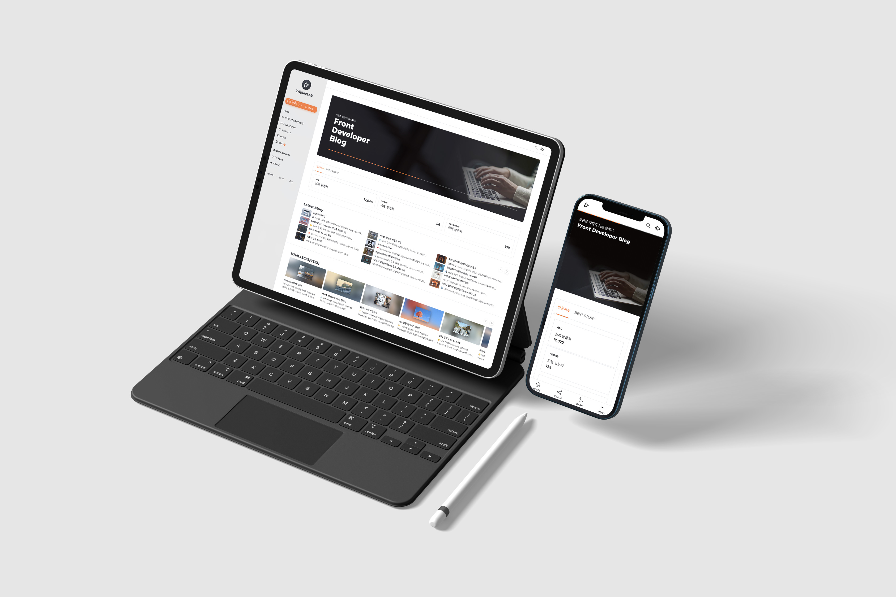

# TriplexLab Blog(v1)
Tistory TriplexLab Blog

## Introduction
Tistory전용 Skin을 커스텀 마이징 하였습니다.\
해당스킨은 무료입니다. 다운받으실때 Star을 한번씩 눌러주시면 감사하겠습니다.\
별이 많으면 많을수록 업그레이드 하는데 큰 힘이 됩니다.😁👍🏻\
프론트앤드의 기본 기술인 HTML, CSS, Javascript, jQuery를 사용하였습니다.\
그리고 누구나 커스터마이징을 할 수 있습니다.(이용방법은 하단에 링크을 참고 해주세요😃)\
[TriplexLab SKIN(v1)](https://triplexlab.tistory.com/126)

## Tech Stack

-F7DF1E?style=flat-square&logo=JavaScript&logoColor=black)

## TriplexLab Blog 사이트
[TriplexLab 블로그](https://triplexlab.tistory.com/126)

## 👨‍💻 브라우저 지원 환경
TriplexLab SKIN은 모던 웹 브라우저에 대해서만 지원하고 있습니다.\
IE는 다음과 같은 이유로 지원하고 있지 않습니다.\

구글 검색 엔지에서 콘텐츠의 가치를 기준으로 문서 순위를 매기지만 웹사이트의 퍼포먼스도 기준에 영향을 줍니다.\
최적화된 웹사이트의 경우 구글 검색 엔진이 좀 더 높은 점수를 줍니다.\
TriplexLab SKIN은 사용자들에게 최적화된 SEO를 제공하기 위해 퍼포먼스를 고려해서 구현된 스킨입니다.\

DEMO버전의 스킨 속도 및 SEO 개선 모습\
라이트하우스 부분에서 개선하지 못하는 부분은 티스토리에서 자동으로 삽입되는 스크립트 또는 디자인의 아이덴티티 요소인 명함대비 이슈가 있어서 스킨을 개발하는 개발자가 개선할 수 없는 영역입니다.\

더 자세한 내용은 해당 링크를 참고하세요[[스킨 설명서](https://thdbsgh3443.gitbook.io/triplexlab-1)]
